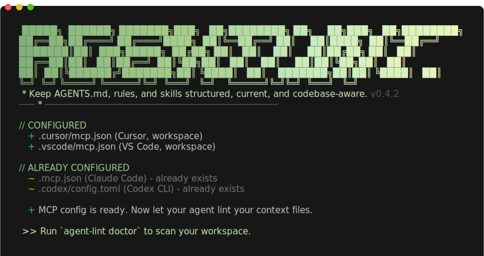
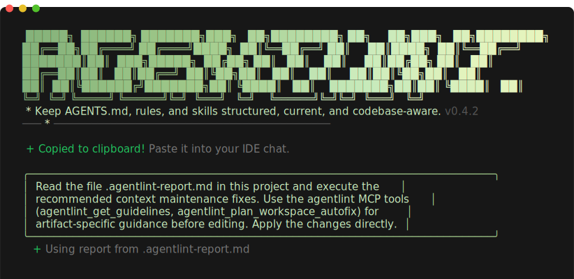
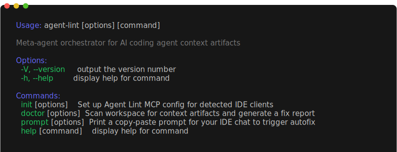

<div align="center">


# Agent Lint

### **ESLint for your coding agents.**

Bad context = Bad code

Agent Lint ensures your `AGENTS.md`,`SKILL.md` and rules are perfected and current.


[Quick Start](#-quick-start) · [MCP Tools](#-mcp-tools) · [CLI](#-cli) · [Installation](#-installation)

<br />


</div>

---

## The Problem

Your `AGENTS.md`, `CLAUDE.md`, cursor rules, and skills files are **the operating system of your coding agent.** They control how your agent thinks, writes code, and makes decisions.

**Context files are important**

Yet most teams either:

- Write these files once and never revisit them
- Let their coding agent generate its own context — producing **generic, bloated, unfocused instructions**
- Have no standard for what a good `AGENTS.md` or rules file looks like
- Forget to update context when the codebase changes

**Agent Lint solves this.**

It acts as a **meta-agent orchestrator** — guiding your AI coding agent to create, maintain, and improve context artifacts using curated best practices from Cursor, Windsurf, Claude, VS Code, and community standards.

---


<table width="100%">
<tr>
<td width="50%" valign="top">

### ❌ Without Agent Lint

- Vague, generic instructions that **waste thousands of tokens**
- Context files become **stale** as the codebase evolves
- Every developer writes context files differently — **zero consistency**
- No way to know if your `AGENTS.md` actually follows **best practices**
- Agents generate their own rules — often **repetitive and low-quality**

</td>
<td width="50%" valign="top">

### ✅ With <font color="#6367FF">A</font><font color="#6367FF">g</font><font color="#7078FF">e</font><font color="#7078FF">n</font><font color="#8494FF">t</font> <font color="#C9BEFF">L</font><font color="#C9BEFF">i</font><font color="#E4CCFE">n</font><font color="#E4CCFE">t</font>

- **Comprehensive guidelines** for every artifact type — what to include, what to avoid
- **Workspace scanning** detects missing and incomplete artifacts automatically
- **Quick check** after every structural change — knows when context needs updating
- **Persistent maintenance rules** keep your agent disciplined across sessions
- Works with **every major IDE** — Cursor, Windsurf, VS Code, Claude

</td>
</tr>
</table>


---

## Quick Start

Set up Agent Lint in your project in 2 minutes:

### 1. Auto-detect your IDE and create MCP config

```bash
npx @agent-lint/cli init
```

<details>
<summary>See output</summary>
<br />

</details>

### 2. Scan your workspace and generate a fix report

```bash
npx @agent-lint/cli doctor
```

<details>
<summary>See output</summary>
<br />

</details>

### 3. Get a copy-paste prompt for your IDE chat

```bash
npx @agent-lint/cli prompt
```

<details>
<summary>See output</summary>
<br />

</details>

<br />

Paste the prompt into your IDE's AI chat. Your coding agent will use Agent Lint's MCP tools to scan, create, and fix all context artifacts — applying changes directly.

**No API keys. No database. No LLM on the server side. Everything runs locally.**

---

## Installation

### Automatic (Recommended)

```bash
npx @agent-lint/cli init
```

This auto-detects your IDE (Cursor, Windsurf, VS Code, Claude) and creates the appropriate MCP config file.

### Manual Setup

<details open>
<summary><b>Cursor</b></summary>

Add to `.cursor/mcp.json`:

```json
{
  "mcpServers": {
    "agentlint": {
      "command": "npx",
      "args": ["-y", "@agent-lint/mcp"]
    }
  }
}
```

</details>

<details>
<summary><b>Windsurf</b></summary>

Add to `.windsurf/mcp_config.json`:

```json
{
  "mcpServers": {
    "agentlint": {
      "command": "npx",
      "args": ["-y", "@agent-lint/mcp"]
    }
  }
}
```

</details>

<details>
<summary><b>VS Code / GitHub Copilot</b></summary>

Add to `.vscode/mcp.json`:

```json
{
  "servers": {
    "agentlint": {
      "type": "stdio",
      "command": "npx",
      "args": ["-y", "@agent-lint/mcp"]
    }
  }
}
```

</details>

<details>
<summary><b>Claude Desktop</b></summary>

Add to `claude_desktop_config.json`:

```json
{
  "mcpServers": {
    "agentlint": {
      "command": "npx",
      "args": ["-y", "@agent-lint/mcp"]
    }
  }
}
```

</details>

<details>
<summary><b>Claude Code CLI</b></summary>

```bash
claude mcp add agentlint -- npx -y @agent-lint/mcp
```

</details>

---

## MCP Tools

Agent Lint provides **4 MCP tools** that your coding agent calls automatically:

| Tool                                 | What It Does                                                                                                                                                      |
| :----------------------------------- | :---------------------------------------------------------------------------------------------------------------------------------------------------------------- |
| `agentlint_get_guidelines`           | Returns comprehensive guidelines for creating or updating any artifact type — mandatory sections, do/don't lists, anti-patterns, templates, and quality checklist |
| `agentlint_plan_workspace_autofix`   | Scans your workspace, discovers all context artifacts, identifies missing files and incomplete sections, and returns a step-by-step fix plan                      |
| `agentlint_quick_check`              | After structural changes (new modules, config changes, dependency updates), checks if context artifacts need updating                                             |
| `agentlint_emit_maintenance_snippet` | Returns a persistent rule snippet for your IDE that keeps your agent maintaining context automatically                                                            |

### MCP Resources

| Resource                        | Content                                       |
| :------------------------------ | :-------------------------------------------- |
| `agentlint://guidelines/{type}` | Full guidelines for an artifact type          |
| `agentlint://template/{type}`   | Skeleton template for creating a new artifact |
| `agentlint://path-hints/{type}` | File discovery patterns per IDE client        |

### Example Prompts

```
Create an AGENTS.md for this project following best practices.
```

```
Scan this workspace and fix all context artifacts.
```

```
Set up automatic context maintenance for Cursor.
```

Your agent calls the appropriate Agent Lint tools, gets structured guidelines, and creates or fixes artifacts directly.

---

## CLI



| Command             | Purpose                                   |
| :------------------ | :---------------------------------------- |
| `agent-lint init`   | Auto-detect IDEs, create MCP config files |
| `agent-lint doctor` | Scan workspace, generate fix report       |
| `agent-lint prompt` | Output a copy-paste prompt for IDE chat   |

### Doctor Options

```bash
agent-lint doctor --stdout    # Print to stdout instead of file
agent-lint doctor --json      # JSON output for programmatic use
```

---

## Supported Artifacts

| Type          | File Patterns                                               |
| :------------ | :---------------------------------------------------------- |
| **Agents**    | `AGENTS.md`, `CLAUDE.md`, `.github/copilot-instructions.md` |
| **Rules**     | `.cursor/rules/*.md`, `.windsurf/rules/*.md`                |
| **Skills**    | `.cursor/skills/*/SKILL.md`, `.windsurf/skills/*/SKILL.md`  |
| **Workflows** | `.cursor/workflows/*.md`, `.windsurf/workflows/*.md`        |
| **Plans**     | `docs/*.md`, `.windsurf/plans/*.md`                         |

---

## How It Works

```
You: "Create AGENTS.md for this project"
  |
  v
Your Agent calls: agentlint_get_guidelines({ type: "agents" })
  |
  v
Agent Lint returns: Mandatory sections, do/don't lists, template, anti-patterns
  |
  v
Your Agent: Scans your codebase, fills in the template, applies changes directly
  |
  v
Result: AGENTS.md created with proper structure
```

**Agent Lint never writes files.** It provides the knowledge. Your agent does the work. You stay in control.

---

## Design Principles

| Principle                      | Detail                                                                |
| :----------------------------- | :-------------------------------------------------------------------- |
| **Zero File Writes**           | MCP server never writes files. Client LLM handles all edits.          |
| **No LLM Server-Side**         | No API keys, no tokens, no cost. Fully deterministic.                 |
| **Stateless**                  | Every call is independent. No database, no cache.                     |
| **Minimum Deps**               | Published packages < 5 MB.                                            |
| **Guidance, Not Instructions** | Provides guidelines and plans — your agent decides how to apply them. |

---

## Architecture

```
packages/
  shared/    -> Common types, parser, conventions, schemas
  core/      -> Guidelines, workspace discovery, plan building
  mcp/       -> MCP server (stdio + HTTP transport)
  cli/       -> CLI interface (init, doctor, prompt)
```

| Package           | Status                                                                                                                |
| :---------------- | :-------------------------------------------------------------------------------------------------------------------- |
| `@agent-lint/mcp` | [](https://www.npmjs.com/package/@agent-lint/mcp) |
| `@agent-lint/cli` | [](https://www.npmjs.com/package/@agent-lint/cli) |

---

## Contributing

```bash
pnpm install
pnpm run build
pnpm run test          # 140+ tests
pnpm run typecheck
```

### Regenerating Screenshots

Screenshots in `docs/screenshots/` are generated with [freeze](https://github.com/charmbracelet/freeze):

```bash
node scripts/generate-screenshots.mjs
```

---

## License

[MIT](LICENSE)

---

<div align="center">

**Your agents are only as good as the context you give them.**

**[Get Started ->](#quick-start)**

</div>
