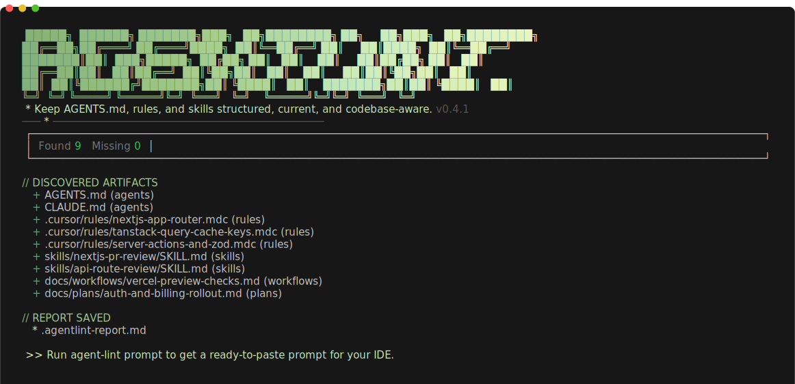

# Agent Lint

### **ESLint for your coding agents.**

Bad context = bad code.

Keep `AGENTS.md`, rules, and skills structured, current, and codebase-aware.

Agent Lint helps coding agents maintain the files that shape how they work: `AGENTS.md`, `CLAUDE.md`, rules, skills, workflows, and plans. It stays local, does not call an LLM, and keeps the MCP server read-only. The CLI can write MCP client config when you run `init`; repository edits still belong to the client agent.

[CLI on npm](https://www.npmjs.com/package/@agent-lint/cli) | [MCP on npm](https://www.npmjs.com/package/@agent-lint/mcp) | [GitHub](https://github.com/samilytu/agentlint) | [GitLab](https://gitlab.com/bsamilozturk/agentlint)



## The Problem

Your `AGENTS.md`, `CLAUDE.md`, rules, and skills files are the operating system of your coding agent. They shape how the agent plans, writes code, and makes decisions.

Without a standard, agent context files drift fast:

- `AGENTS.md` and rules are written once and forgotten.
- New modules, scripts, or workflows appear, but the context never catches up.
- Different developers write different styles of instructions.
- Agents generate vague, repetitive context that costs tokens and misses project details.

Agent Lint gives your coding agent a repeatable workflow:

- set up MCP config with `agent-lint init`
- scan the workspace with `agent-lint doctor`
- paste a ready-made prompt with `agent-lint prompt`
- use 4 MCP tools and 3 MCP resources to keep context artifacts aligned with the codebase

## 60-Second Quickstart

Install nothing up front:

```bash
npx @agent-lint/cli init
npx @agent-lint/cli doctor
npx @agent-lint/cli prompt
```

What each step does:

1. `init` detects supported IDE clients and writes the right MCP config entry.
2. `doctor` scans the repository and creates a workspace report.
3. `prompt` prints a ready-to-paste prompt for your IDE chat so the agent can act on the report.

If you prefer direct MCP usage:

```bash
npx -y @agent-lint/mcp
```

## What You Get

### CLI commands

| Command | Purpose |
| --- | --- |
| `agent-lint init` | Set up Agent Lint MCP config for supported IDE clients |
| `agent-lint doctor` | Scan the workspace and generate a context maintenance report |
| `agent-lint prompt` | Print a ready-to-paste IDE prompt that tells the agent what to do next |

### MCP tools

| Tool | Purpose |
| --- | --- |
| `agentlint_get_guidelines` | Return artifact-specific guidance before creating or updating context files |
| `agentlint_plan_workspace_autofix` | Scan a workspace and return a step-by-step fix plan |
| `agentlint_quick_check` | Check whether recent code changes require context updates |
| `agentlint_emit_maintenance_snippet` | Return a persistent rules snippet for ongoing context hygiene |

### MCP resources

| Resource | Purpose |
| --- | --- |
| `agentlint://guidelines/{type}` | Readable guidelines for one artifact type |
| `agentlint://template/{type}` | Skeleton template for a new artifact |
| `agentlint://path-hints/{type}` | File discovery hints for each IDE client |

## Why Not Maintain These Files By Hand?

| Hand-written workflow | Agent Lint workflow |
| --- | --- |
| Every repo starts from scratch | The agent gets the same artifact guidance every time |
| Context gets stale after structural changes | `doctor` and `quick_check` make drift visible |
| Rules differ across developers and repos | Artifact expectations stay consistent |
| Copy-paste prompts are written ad hoc | `prompt` gives a repeatable handoff into IDE chat |

## Supported Clients

`agent-lint init` supports Cursor, Windsurf, VS Code, Claude Desktop, Claude Code, OpenCode, Cline, Kiro, Zed, and Codex CLI.

For exact formats and scope support, see:

- [CLI package README](packages/cli/README.md)
- [MCP package README](packages/mcp/README.md)

## Design Constraints

- Local only. No database, auth layer, or hosted LLM.
- MCP is read-only. Agent Lint provides guidance; the client agent applies changes.
- Strict TypeScript monorepo with bundled internal packages.
- Independent package versioning for `@agent-lint/cli` and `@agent-lint/mcp`.

## Repository and Releases

- GitHub is the canonical public home for docs, issues, and release discovery.
- GitLab CI is the authoritative publish path for npm releases and provenance.
- Release tags are package-scoped: `cli-vX.Y.Z` and `mcp-vX.Y.Z`.
- Contributors add Changesets in feature and fix PRs; GitLab prepares a single release MR from those pending changes.
- Merging the release MR creates tags automatically, publishes from the protected `production` environment, and mirrors those tags back to GitHub.

## Contributing

```bash
pnpm install
pnpm run build
pnpm run typecheck
pnpm run lint
pnpm run test
```

Public contribution guidance lives in [CONTRIBUTING.md](CONTRIBUTING.md). Release steps live in [PUBLISH.md](PUBLISH.md).

## License

[MIT](LICENSE)
